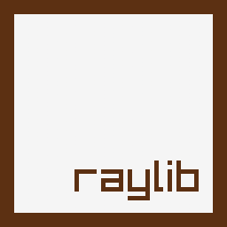

# raylib-chaiscript
[](https://travis-ci.org/RobLoach/raylib-chaiscript)

[ChaiScript](https://chaiscript.com) bindings for [raylib](https://www.raylib.com/), a simple and easy-to-use library to enjoy videogames programming (www.raylib.com)

## Example

The following is an example of what raylib looks like through ChaiScript:

``` chaiscript
var screenWidth = 800
var screenHeight = 450
InitWindow(screenWidth, screenHeight, "raylib [core] example - basic window")
SetTargetFPS(60)

while (!WindowShouldClose()) {
    BeginDrawing();
    ClearBackground(RAYWHITE)
    DrawText("Congrats! You created your first window!", 190, 200, 20, LIGHTGRAY)
    EndDrawing()
}
CloseWindow()        // Close window and OpenGL context
```

Check for more [examples](examples) organized by raylib modules.

## Usage

There are a number of ways to use *raylib-chaiscript*. The following covers its API binding, and a launcher tool...

### CLI

There is a command-line interface tool to quickly launch .chai files with raylib, named [raylib-chaiscript](tools/raylib-chaiscript/raylib-chaiscript.cpp). This allows running raylib-chaiscript
.chai scripts directly from the command line, or just with *drag & drop* of .chai files into *raylib-chaiscript.exe*.

```
./raylib-chaiscript core_basic_window.chai
```

It can be compiled for other platforms, just need to include ChaiScript and link raylib. For more details, just check comments on [raylib-chaiscript.cpp](bin/raylib-chaiscript.cpp).

### API Binding

To integrate *raylib-chaiscript* directly into an existing project, the single header-only file, [raylib.hpp](include/chaiscript/extras/raylib.hpp), is used. To add the raylib bindings to your project you will need to...

1. Include that file in your project:
    ``` c++
    #include "chaiscript/extras/raylib.hpp"
    ```

2. Add the module to your ChaiScript instance:
    ``` c++
    auto raylib = chaiscript::extras::raylib::bootstrap();
    chai.add(raylib);
    ```

3. Evaluate a file with some raylib code:
    ``` c++
    chai.eval_file("core_basic_window.chai");
    ```

## License

*raylib-chaiscript* is licensed under an unmodified zlib/libpng license, which is an OSI-certified,
BSD-like license that allows static linking with closed source software. Check [LICENSE](LICENSE) for further details.

*Copyright (c) 2018 Rob Loach ([@RobLoach](https://twitter.com/RobLoach))*
